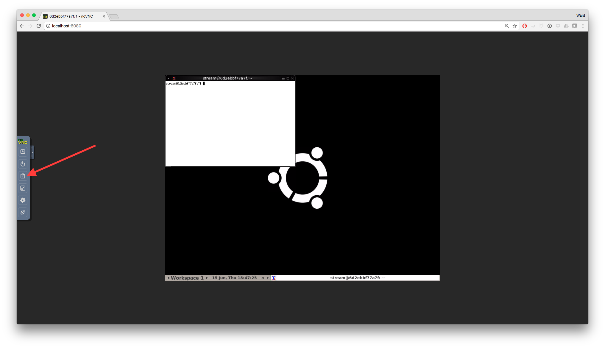
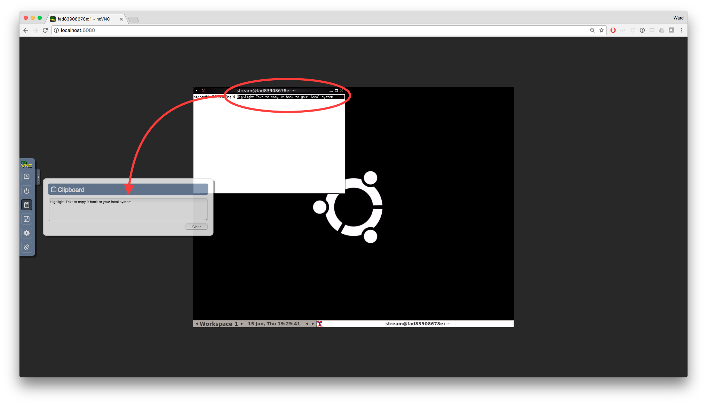

CloudStream
===========

* [Travis-CI Dashboard](https://travis-ci.org/Unidata/cloudstream):    

Table of contents
-----------------

* [Introduction](#introduction)
* [Requirements](#requirements)
* [Building CloudStream-enabled Software](#custom)
* [Using CloudStream](#usage)
* [CloudStream Runtime Options](#options)
* [CloudStream Option Syntax](#syntax)
* [Other Resources](#refs)

Introduction 
------------

***CloudStream*** is a Docker-based framework/container for *Application Streaming*. ***Application Streaming*** describes the process by which software is run on a remote server but is accessed on a device as though it were running locally.  The CloudStream framework provides an environment pre-built to provide remote application access via a web browser.  All that is required to use CloudStream is include your own Linux software!

### Requirements 

CloudStream is a **Docker** image, which other images may be built on.  As a result, using CloudStream requires a local Docker installation.  Instructions for installing Docker may be found [here](https://docs.docker.com/).

Building CloudStream-enabled Software 
-------------------------------------

> All you need to build a CloudStream-enabled Docker image is a custom Docker configuration file, called a `Dockerfile`.  This section describes Dockerfiles in general, and how to construct a Dockerfile which uses CloudStream.

CloudStream provides the technology stack required for an application-streaming-enabled environment.  This includes a virtual desktop environment which can be accessed via a web browser.  Using CloudStream is as simple as defining a new project which *inherits* from the CloudStream Docker image, `unidata/cloudstream`. This allows a project to inherit the application-streaming technology stack and default CloudStream options.  

How do you define a project which inherits from `unidata/cloudstream`? With a custom **Docker configuration file**.

### Docker configuration files

Docker images are built using configuration files referred to as a `Dockerfile`.  Examples of various types of Dockerfiles may be found in the `examples/` directory, and a robust, annotated Dockerfile template for Ubuntu/Debian systems is also included in the CloudStream project (`Dockerfile.template`).  It is also directly viewable [here](https://github.com/Unidata/cloudstream/blob/master/Dockerfile.template).  This template is designed to serve as a starting point for building your own Docker image.

The Docker organization also provides documentation for building and configuring your own Dockerfile.  This documentation may be found [at their website](https://docs.docker.com/engine/reference/builder/).

### Building your own Docker image

In order to stream your GUI application through a web browser, you must build a Docker container *on top of* and existing `unidata/cloudstream` image. 

#### Ubuntu/Debian Dockerfile

A new Docker application based on `unidata/cloudstream:latest` (Ubuntu) begins as 

    FROM unidata/cloudstream:latest
    USER root
    # Run in non-interactive mode
    ENV DEBIAN_FRONTEND noninteractive
    # Run any command here...
    COPY start.sh ${HOME}/

#### CentOS 7 Dockerfile

A new Docker application based on `unidata/cloudstream:centos7` begins as 

    FROM unidata/cloudstream:centos7
    ENV APPLICATION_VERSION 1.0.0
    # Run any command here...
    COPY start.sh ${HOME}/
    
The file `start.sh` will be run by `bootstrap.sh` to execute your own application, and must be present in `${HOME}` (`/home/stream`).

Once a custom Dockerfile has been configured, building your project is as simple as:

    $ docker build -t [your project name] -f [your Dockerfile] .

To run this custom Docker image, you would run the following from the command line:

    $ docker run -it -p 6080:6080 [your project name]

Your Docker image would then be viewable by entering the following address in a web browser:

    http://[IP address of the machine running the image]:6080

Usage
-----

### Connecting

CloudStream instances are typically accessed via a web browser.  Clicking the `connect` button will take you into your cloud-enabled application.  

### Using cut-and-paste

The clipboard is controlled using the panel on the left side of the browser window, and is represented by the third icon from the top. Text pasted into the `Clipboard` panel will be copied to the CloudStream clipboard, and can be pasted in the browser window via the **Middle Mouse Button**.

Text pasted into the `Clipboard` panel will be copied to the CloudStream clipboard, and can be pasted in the browser window via the **Middle Mouse Button**.   

Highlighting text in the CloudStream application will cause it to be copied into the `Clipboard` panel, allowing it to be copied-and-pasted back to your local computer.

### Options

**CloudStream** has several options built-in, enumerated below.  These options are inherited by any CloudStream-based Docker images, although these options may be removed or have their default values changed by a developer.  Additionally, it is easy for a developer to add additional options for use in their CloudStream-based image. The variables and their syntax are described below.

Below are the options available for use with `unidata/cloudstream`.  They are organized into three groups, `Information Options`, `Security Options` and `Display Options`.

#### Information Options 

Option | Note
-------|------
HELP   | Displays the CloudStream help file, plus any custom `README` information defined in a dependent package using the `README_FILE` environmental variable.
VERSION | Displays the CloudStream version, plus any custom version specified by a dependent image.  See `Dockerfile.template` for the syntax used to specify this.
COPYRIGHT | Displays the CloudStream copyright, plus any custom `COPYRIGHT` information defined in a dependent package using the `COPYRIGHT_FILE` environmental variable.

#### Security Options 
Option | Note
-------|-----
USEPASS | Specifies a password to be used for the session.  `Default: no password`.
SSLONLY | Disable unencrypted http-based connections.  Off by default. Set to `TRUE` to enable.
SHARED | Allow for multiple, concurrent connections.  Off by default. Set to `TRUE` to enable.

#### Display Options 

Option | Note
-------|-----
SIZEW | The width of the display provided by CloudStream. `Default: 1024`
SIZEH | The height of the display provided by CloudStream. `Default: 768`
CDEPTH | The color depth of the display provided by CloudStream. `Default: 24`

#### Docker-specific Options

> You will notice in all of our examples, we consistently pass the `-it` option to Docker. This tells Docker to run as an `interactive shell`, and is required for `unidata/cloudstream` to work properly.

In addition to the CloudStream options outlined above, you will need to expose port `6080` using the Docker flags `-p` or `-P`.  The `-p` option allows you to specify a specific port mapping, e.g. `-p 6081:6080` would result in a running docker image accessible on port `6081`.  The `-P` option specifies a dynamic port mapping, where Docker will find an available port.  You would then need to use `docker ps` to determine what port was selected.  This would work as follows:

    $ docker run -it -P  unidata/cloudstream
    $ docker ps
    CONTAINER ID        IMAGE                 COMMAND                  CREATED             STATUS              PORTS                     NAMES
    47de1934777f        unidata/cloudstream   "/bin/sh -c /home/${C"   52 seconds ago      Up 51 seconds       0.0.0.0:32768->6080/tcp   big_pare

In this example, we see that we would connect to the `unidata/cloudstream`-based image by opening a web browser and going to `[Server IP Address]:32768`.

### Syntax 

CloudStream options are handled by passing particular environmental variables to the unidata/cloudstream image (or any derived image) when it is run by Docker.  This is accomplished using the `-e` flag provided by Docker, and the basic syntax is as follows:

    $ docker run -it -e OPTION1=VALUE2 -e OPTION2=VALUE2 unidata/cloudstream

Read below for examples using specific options available to CloudStream.

#### View the unidata/cloudstream version information:

    $ docker run -it -e VERSION=TRUE unidata/cloudstream
    CloudStream Version: "1.0.0 - development"	Thu Jan 28 21:23:27 UTC 2016

#### Run unidata/cloudstream with custom display geometry, password protected, accessible on port 6080:

    $ docker run -it -p 6080:6080 -e USEPASS=password1234 -e SIZEW=800 -e SIZEH=600 -CDEPTH=16 unidata/cloudidv

Other Resources <A NAME="refs">
---------------

For more information on Docker syntax and using CloudStream as a basis for other application-streaming applications, see the following resources:

* Unidata CloudStream project page: [https://github.com/Unidata/cloudstream/](https://github.com/Unidata/cloudstream)
* Unidata CloudIDV project page:  [https://github.com/Unidata/cloudidv/](https://github.com/Unidata/cloudidv)
* Unidata CloudAWIPS project page:  [https://github.com/Unidata/CloudAWIPS/](https://github.com/Unidata/CloudAWIPS)
* Unidata CloudGEMPAK project page:  [https://github.com/Unidata/CloudGEMPAK/](https://github.com/Unidata/CloudGEMPAK)
* Dockerfile Syntax: [https://docs.docker.com/engine/reference/builder/](https://docs.docker.com/engine/reference/builder)
